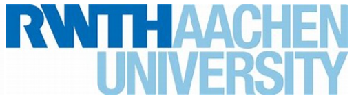
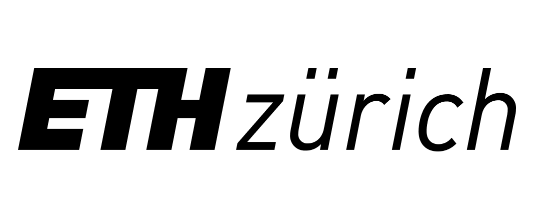
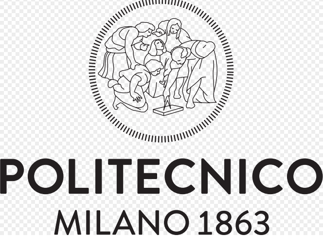
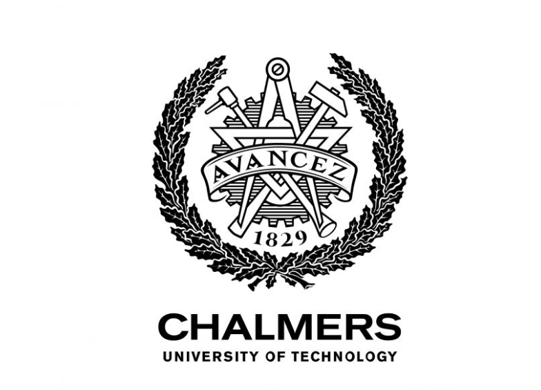

# ERC Advanced Grant 2025 – IDEA League Consortium

Welcome to the official page of our research consortium formed by leading universities of the **IDEA League**. We aim to tackle [insert challenge/topic] through a joint application to the **ERC Advanced Grant**.

## Consortium Members

<table>
  <tr>
    <td></td>
    <td></td>
    <td></td>
    <td></td>
    <td></td>
  </tr>
</table>

## Our Proposal

**Title:** [Project Title]  
**Focus:** [One-sentence research challenge or vision]  
**Principal Investigators:**
- Prof. Bernd Markert - RWTH Aachen
- Dr. Franz Bamer – RWTH Aachen
- Dr. sc. S. Swayamjyoti – RWTH Aachen
- Dr. Paolo Tiso – ETH Zurich
- Prof. Paul Breedveld – TU Delft
- Dr. Leslie Zachariah - TU Delft
- Prof. Andrea Bernasconi – Politecnico di Milano
- Prof. Masarati Pierangelo – Politecnico di Milano
- Prof. Serena Graziosi - Politecnico di Milano
- Prof. Kristina Wärmefjord – Chalmers University of Technology
- Prof. Rikard Söderberg - Chalmers University of Technology

## Objectives

- 🔬 Advance research in [field/topic]
- 🌍 Enable international collaboration within the EU
- 🎯 Target major scientific challenges under the ERC framework

## Contact

For inquiries or collaboration interest, contact:

📧 **Email**: grant-consortium@idea-league.org  
📁 **ERC Grant Info**: [ERC Advanced Grant Page](https://erc.europa.eu/funding/advanced-grants)

---

_Last updated: May 2025_
